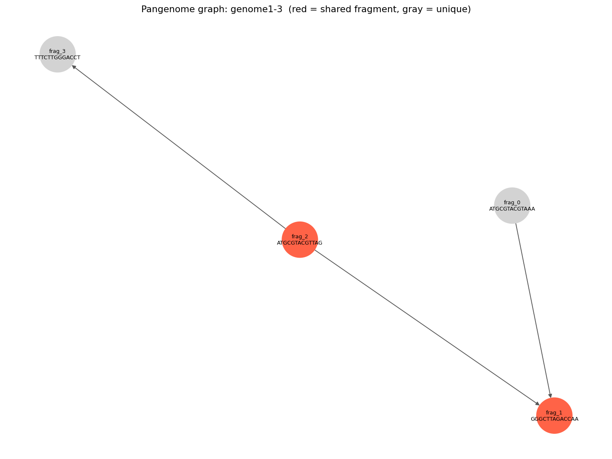
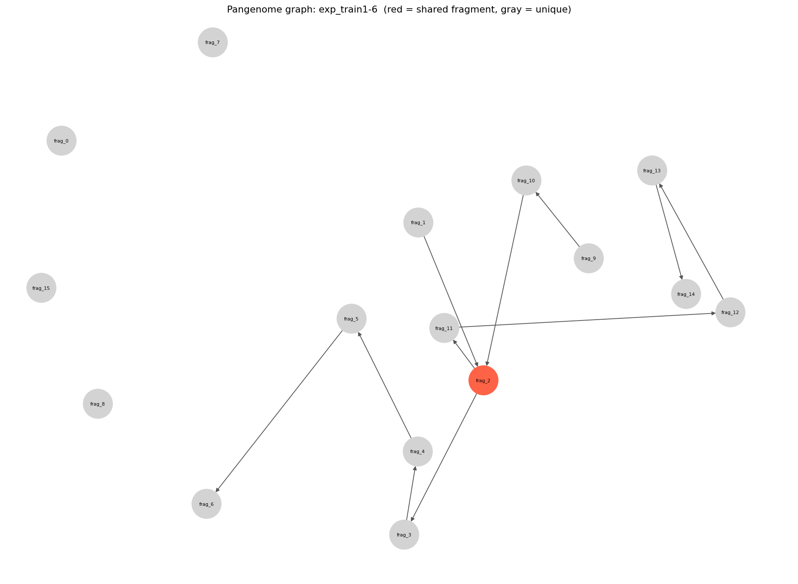

# plaster (graph edition)

A modification of **plaster** that builds a **pangenome graph** instead of a
linear concatenated pangenome, so you can *see* which fragments are shared
between genomes instead of reading a flat FASTA.

Each FASTA record is treated as a fragment. Identical fragments that appear in
more than one genome collapse into a single shared node, which turns the output
from a set of parallel linear paths into a real graph with branch and merge
points.

## Example

Running on three toy genomes (`genome1-3.fasta`) produces this graph — red nodes
are fragments shared across genomes, gray nodes are unique to one:



`frag_2` (`ATGCGTACGTTAG`) is shared by genome1 and genome3 and branches to two
different next fragments; `frag_1` (`GGGCTTAGACCAA`) is a merge point reached by
both genome1 and genome2.

A larger, more realistic run on `exp_train1-6.fasta`:



## Requirements

- Python 3.8+
- [Biopython](https://biopython.org/), [networkx](https://networkx.org/), [tqdm](https://github.com/tqdm/tqdm)
- [matplotlib](https://matplotlib.org/) (only for the visualization scripts)

```bash
pip install -r requirements.txt
```

## Usage

Build a graph from one or more FASTA files:

```bash
python plaster genome1.fasta genome2.fasta genome3.fasta -o real_output
```

This writes three representations of the same graph:

| File | Format | Use |
|------|--------|-----|
| `real_output.gml`      | GML          | Human-readable, easy to inspect |
| `real_output.graphml`  | GraphML      | Opens in Cytoscape / Gephi |
| `real_output.gfa`      | GFA 1.0 (rGFA-style tags) | Opens in [Bandage](https://rrwick.github.io/Bandage/) and other pangenome viewers |

Common options (`python plaster --help` for the full list):

- `-o, --output` &nbsp; output file stem (no extension)
- `-t, --template` &nbsp; seed genome to start the pangenome from
- `-p, --threads` &nbsp; number of threads
- `-v, --verbose` &nbsp; print each `record -> fragment` assignment

## Visualizing

`visualize_graph.py` renders `real_output.graphml` with matplotlib, coloring
shared fragments red and unique fragments gray:

```bash
python visualize_graph.py
```

## How it works

- `plaster` — command-line entry point. Reads each FASTA, deduplicates fragments
  by sequence, and builds the graph.
- `graph_construction.py` — the graph itself: node/edge construction and the
  GML / GraphML / GFA exporters.

## Limitations

Fragments are merged only when their sequences are **exactly identical**. Real
biological overlap is usually *partial* (e.g. two fragments sharing a common
prefix), which requires a sequence aligner such as
[MUMmer's `nucmer`](https://github.com/mummer4/mummer). MUMmer is Linux-only and
is not used in this build, so partial-overlap merging is not currently
available. To add it, run under Linux/WSL with MUMmer installed, or swap in a
pure-Python aligner.
